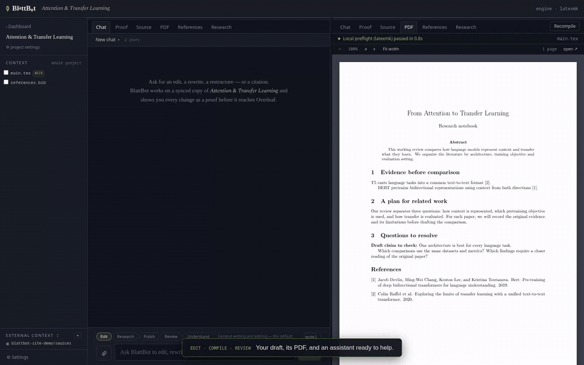

# 🍃 BlattBot (beta)

An agentic LaTeX editor that syncs with any Overleaf. BlattBot runs on your machine with your (Claude) agent built in. You can create local projects, write in the editor, compile, and manage your bibliography without ever touching Overleaf. When you want Overleaf, it connects to any instance. Agent edits land as diffs. Only what you approve gets committed or pushed.



*A real agent session: literature search, citations added to the bibliography and cited in the text, then approved and pushed. Sped up.*

```
Overleaf ⇄ local mirror ⇄ Claude agent (edit → compile → verify)
                       ⇩
         you review the proof → approve → push
```

## Quickstart

```bash
npx blattbot
```

This starts the app on http://127.0.0.1:4560 and opens your browser. On first run BlattBot checks your environment and offers to download [tectonic](https://tectonic-typesetting.github.io) if no TeX engine is found. Run `npx blattbot --help` for flags and `npx blattbot doctor` to see what it detects.

You need Node 20 or newer, git, and [Claude Code](https://claude.com/claude-code) installed and logged in. BlattBot reuses the Claude Code login, so there is no API key to configure.

## What it does

The agent works in a local git mirror and every turn ends in a diff you approve or discard. It compiles after editing and fixes its own LaTeX errors before showing you anything. A citation pipeline searches OpenAlex, Semantic Scholar, DBLP and Crossref, fetches BibTeX, dedupes against your bibliography and inserts the right cite keys. 

## Connecting

Sign in once per Overleaf instance. The easiest way is "Sign in from browser session", which imports the login you already have in Firefox, Chrome or most other browsers. 

Instances with the git bridge (paid overleaf.com plans, Server Pro) can also be connected through a git URL. 

## Security

The server binds to 127.0.0.1 only, checks the Host header on every request and requires a local auth token for the API, so other users and web pages cannot drive it. Secrets live in `~/.local/share/blattbot` with 0600 permissions. Treat that folder like `~/.ssh`. Overleaf cookies are only ever sent to your own Overleaf instance. The agent is blocked from running git commit or push.

## Install from source

```bash
git clone https://github.com/LckyLke/blattbot.git
cd blattbot
npm install
npm run build --workspace=web
npm run dev
```

The app then runs on http://127.0.0.1:4560, same as the npx version.

## Development

npm workspaces. `server/` is Fastify and TypeScript, `web/` is React and Vite.

```bash
npm install
npm run dev                            # server on :4560
npm run dev:web                        # Vite dev server on :4561
npm test                               # unit tests
npx tsx server/scripts/ui-verify.ts    # browser UI verification without agent turns
npx tsx server/scripts/e2e.ts          # full loop with a real agent turn
npm run release:pack                   # build and pack the npm tarball
```

CI runs the suite on Ubuntu, macOS and Windows.

## License

[PolyForm Noncommercial 1.0.0](LICENSE), Luke Friedrichs. Free for personal, academic, and other noncommercial use.
